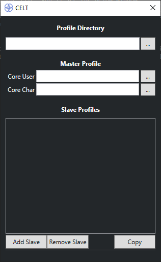
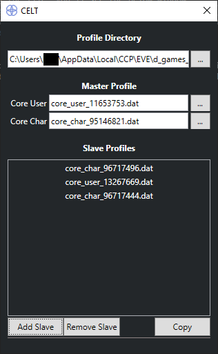

# Copy Eve Layout Tool
This tool allows a user to copy their profile settings between different accounts and characters.

## Usage
- Download the EXE file from the releases page
- After running the file, you'll see the below window

	

- Once you've selected a profile directory, a master core_user and/or master core_char file, and added at least 1 slave, you're good to hit copy!

	

## FAQ
- **What if I only want to copy across user or account settings, but not both?**
  - Account settings are stored in the core_user files, while character settings are stored in the core_char files. You don't need to copy from both at the same time, and the tool will only copy settings from a selected master file. So if you only select a core_user file, only other core_user files will be overwritten, even if you selected one or more core_char slave files.
- **Will this tool break my EVE profile?**
  - As with any tool that plays around with any files, regardless of the context, you should always make a backup
- **Will this tool steal my passwords?**
  - You're probably reading this on github so you can just take a look at the source code and see for yourself. CELT simply automates the tedious process of copying filenames to copies of your main character's files.
